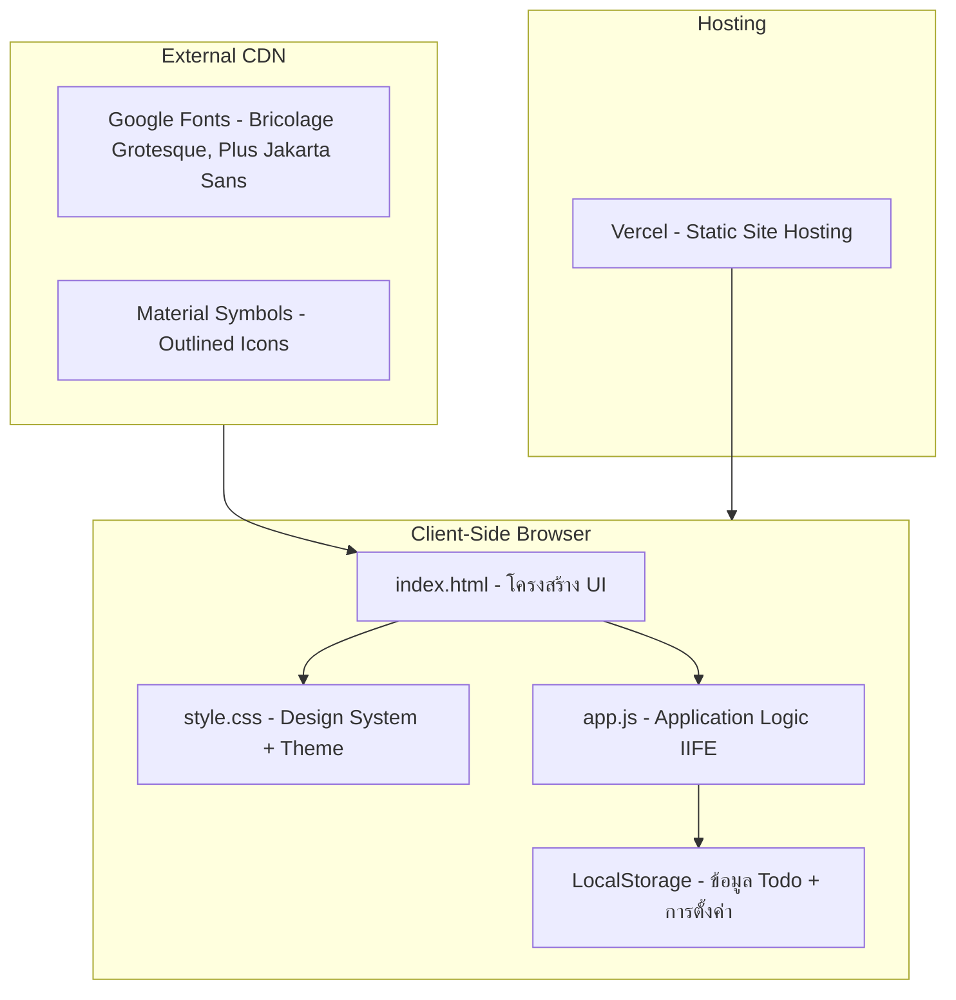
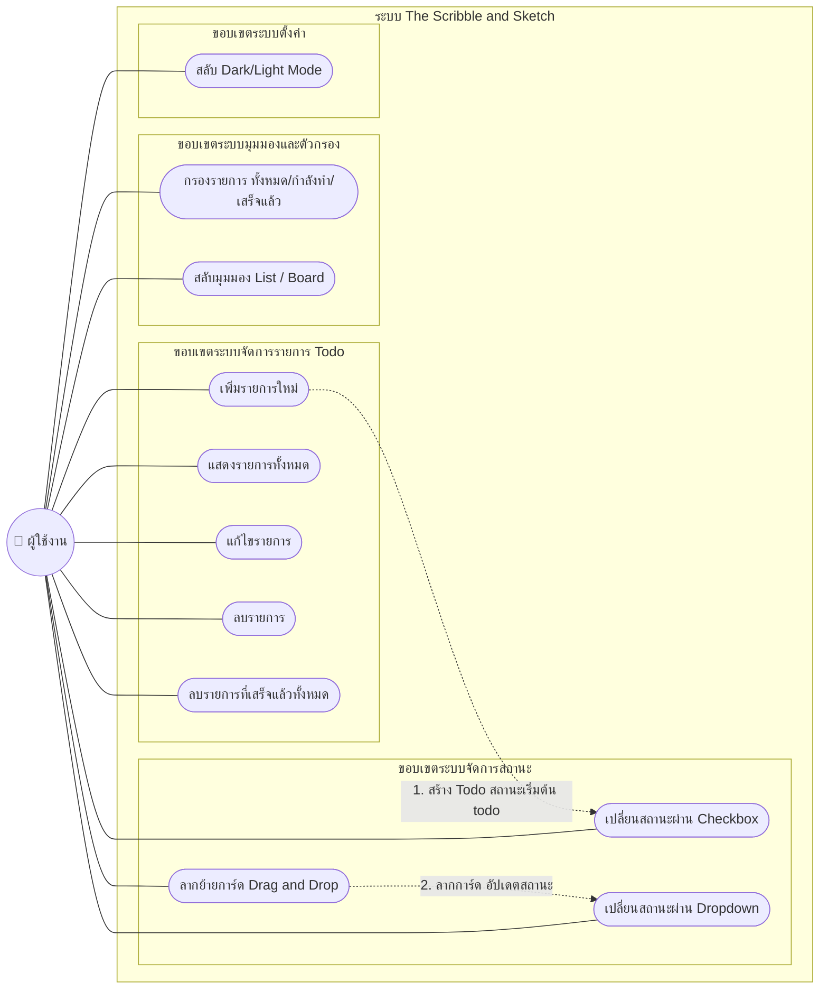
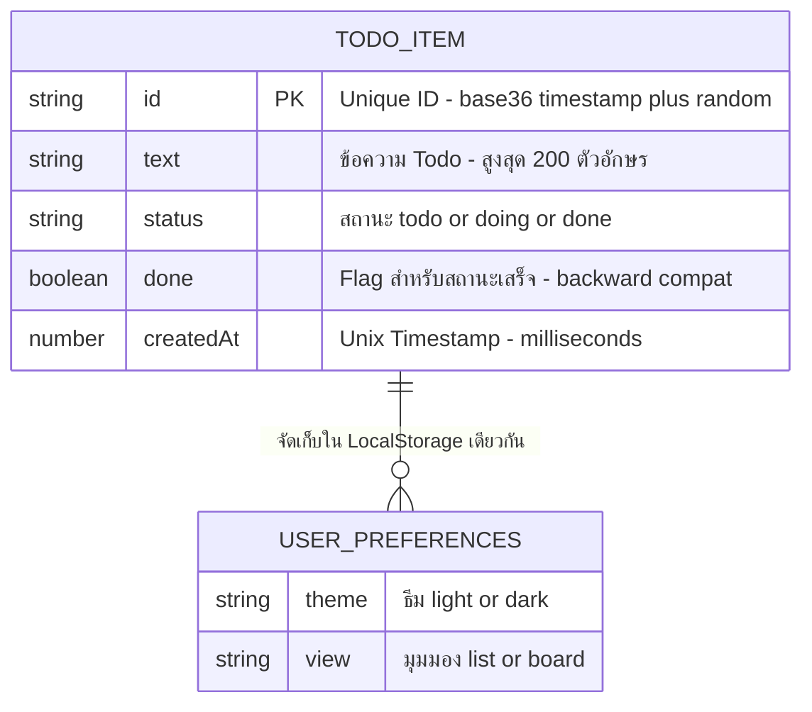
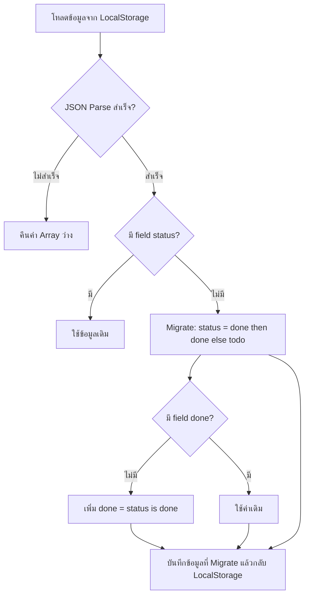
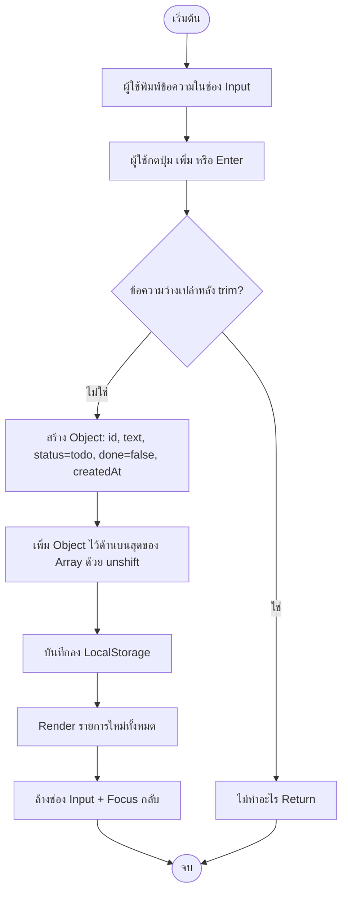
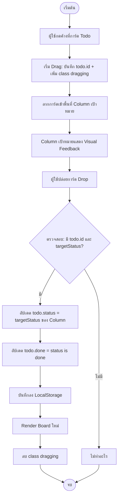
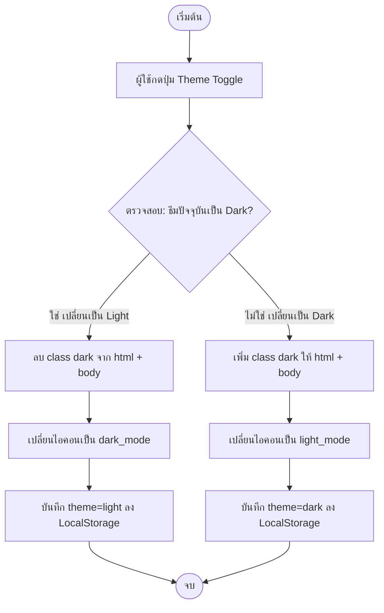
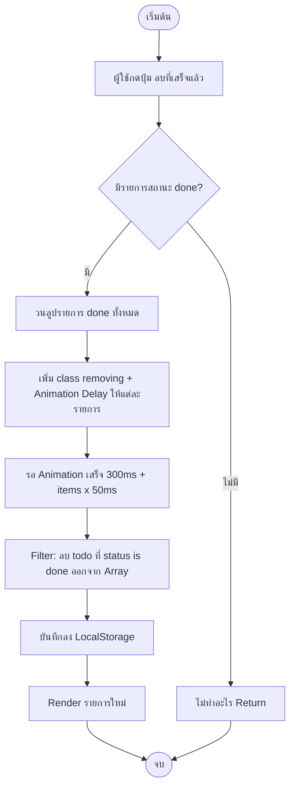
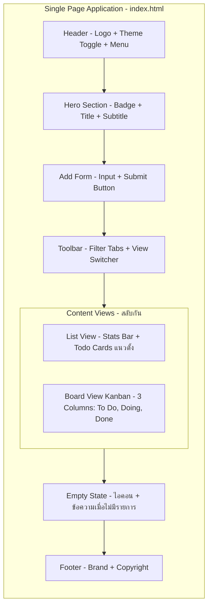

# Software Requirements Specification (SRS)

**ชื่อโปรเจกต์:** The Scribble & Sketch (ระบบบันทึกรายการสิ่งที่ต้องทำ — ธีมร้านเครื่องเขียน)

**เวอร์ชัน:** 1.0.0
**วันที่จัดทำ:** 17 กรกฎาคม 2569
**ผู้จัดทำ:** ทีมพัฒนา The Scribble & Sketch
**สถานะ:** Production (Deploy บน Vercel)

---

## สารบัญ

1. [บทนำ (Introduction)](#1-บทนำ-introduction)
2. [ข้อกำหนดการทำงาน (Functional Requirements)](#2-ข้อกำหนดการทำงาน-functional-requirements)
3. [ข้อกำหนดที่ไม่เกี่ยวกับการทำงาน (Non-Functional Requirements)](#3-ข้อกำหนดที่ไม่เกี่ยวกับการทำงาน-non-functional-requirements)
4. [สถาปัตยกรรมระบบและเทคโนโลยี (System Architecture)](#4-สถาปัตยกรรมระบบและเทคโนโลยี-system-architecture)
5. [Use Case Diagram](#5-use-case-diagram)
6. [โครงสร้างฐานข้อมูล (Entity-Relationship Diagram: ERD)](#6-โครงสร้างฐานข้อมูล-entity-relationship-diagram-erd)
7. [แผนภาพลำดับการทำงาน (Activity Diagram)](#7-แผนภาพลำดับการทำงาน-activity-diagram)
8. [ข้อสมมติฐานและข้อจำกัดของระบบ (Assumptions & Dependencies)](#8-ข้อสมมติฐานและข้อจำกัดของระบบ-assumptions--dependencies)
9. [โครงสร้างและการออกแบบหน้าจอ (User Interface Structure)](#9-โครงสร้างและการออกแบบหน้าจอ-user-interface-structure)
10. [ข้อกำหนดการเชื่อมต่อ API (API Interface Specifications)](#10-ข้อกำหนดการเชื่อมต่อ-api-api-interface-specifications)
11. [สภาพแวดล้อมที่รองรับ (Operating Environment)](#11-สภาพแวดล้อมที่รองรับ-operating-environment)
12. [เกณฑ์การยอมรับระบบ (Acceptance Criteria / UAT)](#12-เกณฑ์การยอมรับระบบ-acceptance-criteria--uat)
13. [อภิธานศัพท์ (Glossary)](#13-อภิธานศัพท์-glossary)

---

## 1. บทนำ (Introduction)

### 1.1 จุดประสงค์ (Purpose)

ระบบนี้พัฒนาขึ้นในรูปแบบ **Web Application** เพื่อเป็นเครื่องมือบันทึกและจัดการรายการสิ่งที่ต้องทำ (Todo-List) สำหรับนักสร้างสรรค์ โดยใช้แนวคิดการออกแบบธีม **ร้านเครื่องเขียน (Stationery Shop)** ที่ให้ความรู้สึกเหมือนการจดบันทึกลงสมุดโน้ตจริง ระบบรองรับทั้งมุมมอง **รายการ (List View)** และ **บอร์ดแบบ Kanban (Board View)** พร้อมฟีเจอร์ Dark/Light Mode เพื่อประสบการณ์การใช้งานที่ยืดหยุ่น

### 1.2 ขอบเขตของระบบ (Project Scope)

- **สิ่งที่ระบบทำได้:** เพิ่ม แก้ไข ลบรายการ Todo, สลับสถานะ (To Do / Doing / Done), กรองรายการตามสถานะ, สลับมุมมอง List/Board, ลากย้ายการ์ดระหว่าง Column (Drag & Drop), สลับโหมดสีมืด/สว่าง และจัดเก็บข้อมูลผ่าน LocalStorage ของเบราว์เซอร์
- **สิ่งที่ระบบไม่ได้ครอบคลุม:** ระบบไม่มีการสมัครสมาชิก/เข้าสู่ระบบ, ไม่มีฐานข้อมูลกลาง (Server-side Database), ไม่มีระบบ Backend API, และไม่รองรับการซิงค์ข้อมูลข้ามอุปกรณ์

### 1.3 กลุ่มผู้ใช้งาน (User Roles)

| บทบาท | คำอธิบาย |
|-------|---------|
| **User (ผู้ใช้งาน)** | บุคคลทั่วไปที่เข้าใช้งานผ่านเว็บเบราว์เซอร์ สามารถจัดการรายการ Todo ได้ทันทีโดยไม่ต้องสมัครสมาชิก ข้อมูลจะถูกจัดเก็บไว้ในเบราว์เซอร์ของผู้ใช้แต่ละคน |

> **หมายเหตุ:** ระบบเวอร์ชันปัจจุบัน (v1.0) เป็นแบบ **Client-side Only** จึงมีผู้ใช้เพียงบทบาทเดียว หากมีการพัฒนาต่อในอนาคต อาจเพิ่มบทบาท Admin สำหรับจัดการข้อมูลส่วนกลางได้

### 1.4 เอกสารอ้างอิง (References)

| แหล่งอ้างอิง | รายละเอียด |
|-------------|-----------|
| IEEE 830-1998 | มาตรฐานการเขียน Software Requirements Specification |
| Material Design 3 | แนวทางการออกแบบ UI (Google Material Symbols) |
| Web Content Accessibility Guidelines (WCAG) 2.1 | มาตรฐานการเข้าถึงเว็บสำหรับผู้พิการ |

---

## 2. ข้อกำหนดการทำงาน (Functional Requirements)

### 2.1 ระบบจัดการรายการ Todo (CRUD Operations)

- **`REQ-TODO-01`** : **เพิ่มรายการใหม่ (Create):** ผู้ใช้สามารถพิมพ์ข้อความในช่อง Input (สูงสุด 200 ตัวอักษร) แล้วกดปุ่ม "เพิ่ม" หรือกด Enter เพื่อสร้างรายการใหม่ รายการที่สร้างจะมีสถานะเริ่มต้นเป็น `todo` พร้อมบันทึกเวลาสร้าง (timestamp) อัตโนมัติ และถูกเพิ่มไว้ด้านบนสุดของรายการ

- **`REQ-TODO-02`** : **แสดงรายการ (Read):** ระบบต้องแสดงรายการ Todo ทั้งหมดที่มีอยู่ทันทีที่เปิดหน้าเว็บ โดยดึงข้อมูลจาก LocalStorage โดยแต่ละรายการจะแสดง: ข้อความ, วันที่สร้าง (รูปแบบ: `วัน เดือนย่อไทย ชั่วโมง:นาที`), สถานะ (To Do / Doing / Done) และ ปุ่มจัดการ (แก้ไข, ลบ, เปลี่ยนสถานะ)

- **`REQ-TODO-03`** : **แก้ไขรายการ (Update):** ผู้ใช้สามารถแก้ไขข้อความของรายการได้ 2 วิธี: กดปุ่ม Edit (ไอคอนดินสอ) หรือ Double-click ที่ข้อความ ระบบจะแปลงข้อความเป็น Input แบบ Inline ให้แก้ไข กด Enter เพื่อบันทึก หรือ Escape เพื่อยกเลิก

- **`REQ-TODO-04`** : **ลบรายการ (Delete):** ผู้ใช้สามารถลบรายการโดยกดปุ่มลบ (ไอคอน ✕) รายการจะมี Animation แบบ Slide-out ก่อนถูกลบออกจากระบบ นอกจากนี้ยังมีปุ่ม **"ลบที่เสร็จแล้ว"** สำหรับลบรายการที่มีสถานะ `done` ทั้งหมดพร้อมกัน

### 2.2 ระบบจัดการสถานะ (Status Management)

- **`REQ-STS-01`** : **สถานะ 3 ระดับ:** รายการ Todo แต่ละรายการมีสถานะ 3 ระดับ ได้แก่:

| สถานะ | ความหมาย | การแสดงผล |
|-------|---------|----------|
| `todo` | สิ่งที่ต้องทำ | แสดงปกติ ไม่มี highlight พิเศษ |
| `doing` | กำลังทำ | มีเส้นขอบซ้ายสีส้ม (accent border) |
| `done` | เสร็จแล้ว | ข้อความขีดฆ่า (line-through) + ความทึบลดลง |

- **`REQ-STS-02`** : **เปลี่ยนสถานะผ่าน Checkbox:** ในมุมมอง List — กดเครื่องหมาย ✓ (Checkbox) จะสลับสถานะระหว่าง `todo` ↔ `done` ทันที

- **`REQ-STS-03`** : **เปลี่ยนสถานะผ่าน Dropdown:** ทั้งมุมมอง List และ Board — ผู้ใช้สามารถเลือกสถานะจาก Dropdown (To Do / Doing / Done) เพื่อย้ายสถานะได้ตามต้องการ

- **`REQ-STS-04`** : **เปลี่ยนสถานะผ่าน Drag & Drop (Board View เท่านั้น):** ในมุมมอง Board — ผู้ใช้สามารถลากการ์ดจาก Column หนึ่งไปยังอีก Column หนึ่งเพื่อเปลี่ยนสถานะ ระบบจะแสดง Visual Feedback (เส้นประ + พื้นหลังเปลี่ยนสี) เมื่อลากเข้าพื้นที่วาง

### 2.3 ระบบกรองรายการ (Filtering System)

- **`REQ-FLT-01`** : **แท็บกรอง (Filter Tabs):** แสดงในมุมมอง List เท่านั้น ประกอบด้วย 3 แท็บ:

| แท็บ | ตัวกรอง | การทำงาน |
|-----|---------|---------|
| **ทั้งหมด** | `all` | แสดงรายการทุกสถานะ |
| **กำลังทำ** | `active` | แสดงเฉพาะรายการที่สถานะเป็น `todo` หรือ `doing` |
| **เสร็จแล้ว** | `done` | แสดงเฉพาะรายการที่สถานะเป็น `done` |

- **`REQ-FLT-02`** : **ป้ายจำนวน (Count Badge):** แต่ละแท็บกรองจะแสดงตัวเลขจำนวนรายการในหมวดนั้นๆ อัปเดตแบบ Real-time เมื่อข้อมูลเปลี่ยนแปลง

### 2.4 ระบบสลับมุมมอง (View Switching)

- **`REQ-VIEW-01`** : **มุมมองรายการ (List View):** แสดงรายการ Todo เรียงในแนวตั้ง พร้อม Filter Tabs, Stats Bar และ Checkbox สำหรับเปลี่ยนสถานะ

- **`REQ-VIEW-02`** : **มุมมองบอร์ด (Board View / Kanban):** แสดงรายการแบ่งเป็น 3 คอลัมน์ตามสถานะ:
  - **สิ่งที่ต้องทำ** (To Do) — พื้นหลัง neutral
  - **กำลังทำ** (Doing) — accent สีส้ม
  - **เสร็จแล้ว** (Done) — accent สีเขียว

  แต่ละคอลัมน์แสดงจำนวนรายการ (Badge Count) และรองรับ Drag & Drop

- **`REQ-VIEW-03`** : **บันทึกมุมมอง:** ระบบจดจำมุมมองที่ผู้ใช้เลือกไว้ล่าสุดผ่าน LocalStorage เมื่อเปิดหน้าเว็บใหม่จะกลับมาที่มุมมองเดิม

### 2.5 ระบบ Dark/Light Mode

- **`REQ-THM-01`** : **สลับธีม:** ผู้ใช้กดปุ่ม 🌙/☀️ บน Header เพื่อสลับระหว่างโหมดสว่าง (Light) และมืด (Dark) ระบบจดจำธีมที่เลือกไว้ผ่าน LocalStorage

- **`REQ-THM-02`** : **ตรวจจับค่าเริ่มต้น:** หากผู้ใช้ยังไม่เคยเลือกธีม ระบบจะตรวจจับ `prefers-color-scheme` ของระบบปฏิบัติการ/เบราว์เซอร์โดยอัตโนมัติ

- **`REQ-THM-03`** : **Smooth Transition:** การสลับธีมจะต้องมี CSS Transition (0.25s ease) สำหรับ background, color, border และ box-shadow เพื่อไม่ให้เกิดการกระพริบ

### 2.6 ระบบจัดเก็บข้อมูล (Data Persistence)

- **`REQ-DAT-01`** : **บันทึกอัตโนมัติ:** ทุกครั้งที่มีการเปลี่ยนแปลงข้อมูล (เพิ่ม/แก้ไข/ลบ/เปลี่ยนสถานะ) ระบบจะบันทึกลง LocalStorage ทันที ภายใต้ Key: `creative-archive-todos`

- **`REQ-DAT-02`** : **Data Migration:** ระบบมีกลไกการ Migrate ข้อมูลเก่า — หากข้อมูลเดิมใช้โครงสร้าง `done: boolean` เพียงอย่างเดียว ระบบจะแปลงเป็นโครงสร้างใหม่ที่ใช้ `status` field โดยอัตโนมัติ

- **`REQ-DAT-03`** : **Error Handling:** หากข้อมูลใน LocalStorage เสียหายหรืออ่านไม่ได้ (JSON parse error) ระบบจะคืนค่าเป็น Array ว่าง `[]` แทนที่จะ crash

### 2.7 Scroll Reveal Animation

- **`REQ-ANI-01`** : **Intersection Observer:** องค์ประกอบที่มี class `.reveal` จะแสดงด้วย Animation เลื่อนขึ้น (translateY) พร้อม fade-in เมื่อ scroll เข้ามาในพื้นที่ที่มองเห็น (threshold 5%)

---

## 3. ข้อกำหนดที่ไม่เกี่ยวกับการทำงาน (Non-Functional Requirements)

### 3.1 การออกแบบและการใช้งาน (Usability & Responsive)

- **Mobile-First Design:** หน้าเว็บถูกออกแบบให้แสดงผลบนสมาร์ทโฟนได้อย่างสมบูรณ์แบบ มี Breakpoint 3 ระดับ:
  - `≤ 480px` — ฟอร์มเพิ่มรายการเรียงแนวตั้ง, ปุ่ม action แสดงตลอด
  - `≤ 768px` — บอร์ด Kanban scroll แนวนอน (snap scroll)
  - `≥ 768px` — เพิ่ม padding ข้างด้วย margin-desktop (40px)

- **Accessibility (ARIA):** ทุกปุ่มและ input มี `aria-label` ภาษาไทย, Checkbox มี label ที่ผูกกับข้อความของ Todo

- **Touch-Friendly:** ขนาดปุ่มและ Interactive elements ≥ 32px ตาม WCAG Touch Target guidelines

### 3.2 ความปลอดภัยและข้อมูลส่วนบุคคล (Security & Privacy)

- **XSS Prevention:** ข้อความ Todo ทุกรายการผ่านฟังก์ชัน `escapeHtml()` ก่อนแสดงผลเพื่อป้องกัน Cross-Site Scripting (XSS)

- **Data Isolation:** ข้อมูลจัดเก็บใน LocalStorage ของเบราว์เซอร์แต่ละเครื่อง ไม่มีการส่งข้อมูลไปยัง Server ใดๆ ความเป็นส่วนตัวของผู้ใช้จึงได้รับการรับประกัน

- **Input Validation:** จำกัดความยาวข้อความ Todo ที่ 200 ตัวอักษร (`maxlength="200"`) และตัดช่องว่างหน้า-หลัง (`trim()`) ก่อนบันทึก

### 3.3 ประสิทธิภาพ (Performance)

- **Zero Server Dependency:** ระบบทำงานได้โดยไม่ต้องติดต่อ Server ใดๆ (ยกเว้นการโหลด Google Fonts และ Material Symbols ครั้งแรก)

- **Optimized Rendering:** ใช้ Event Delegation บน Filter Bar และ View Switcher เพื่อลดจำนวน Event Listeners

- **Animation Performance:** ใช้ CSS `transform` และ `opacity` สำหรับ Animation ทั้งหมดเพื่อให้ทำงานบน GPU (Hardware Accelerated)

- **Font Loading:** ใช้ `rel="preconnect"` สำหรับ Google Fonts เพื่อลด DNS Lookup Time

### 3.4 ความน่าเชื่อถือ (Reliability)

- **Graceful Degradation:** หาก LocalStorage ไม่พร้อมใช้งาน (Private Browsing Mode บางเบราว์เซอร์) ระบบยังคงทำงานได้ แต่ข้อมูลจะไม่ถูกบันทึกข้ามเซสชัน

- **Data Integrity:** ใช้ `try-catch` ในการอ่านข้อมูลจาก LocalStorage เพื่อป้องกัน JSON parsing error

---

## 4. สถาปัตยกรรมระบบและเทคโนโลยี (System Architecture)

### 4.1 สถาปัตยกรรมภาพรวม



### 4.2 เทคโนโลยีฝั่ง Frontend

| เทคโนโลยี | เวอร์ชัน/รายละเอียด | หน้าที่ |
|-----------|---------------------|--------|
| **HTML5** | Semantic Elements | โครงสร้างหน้าเว็บ (header, section, footer, form) |
| **CSS3** | Custom Properties (CSS Variables) | ระบบ Design Tokens, Dark/Light Theme, Responsive Layout |
| **Vanilla JavaScript** | ES6+ (IIFE Pattern) | Application Logic, DOM Manipulation, LocalStorage API |
| **Google Fonts** | Bricolage Grotesque, Plus Jakarta Sans | Typography — Headline + Body fonts |
| **Material Symbols** | Outlined, Variable Weight (100-700) | Icon System (add, edit, close, dark_mode, etc.) |

### 4.3 ระบบจัดเก็บข้อมูล (Storage)

| Storage Key | ประเภทข้อมูล | รายละเอียด |
|------------|-------------|-----------|
| `creative-archive-todos` | `JSON Array` | เก็บข้อมูล Todo ทั้งหมดในรูปแบบ JSON Array of Objects |
| `creative-archive-theme` | `String` | ค่าธีมที่ผู้ใช้เลือก: `"light"` หรือ `"dark"` |
| `creative-archive-view` | `String` | มุมมองที่ผู้ใช้เลือก: `"list"` หรือ `"board"` |

### 4.4 การติดตั้งและการให้บริการ (Hosting & Deployment)

- **Platform:** Vercel (Static Site Hosting)
- **รายละเอียด:** นำไฟล์ HTML/CSS/JS ขึ้น Deploy บน Vercel โดยตรง ไม่ต้องมีขั้นตอน Build เพิ่มเติม เนื่องจากเป็น Static Site ที่ไม่มี Framework หรือ Bundler

---

## 5. Use Case Diagram

แผนภาพ Use Case ที่ทำการแยกขอบเขตการทำงาน (Subsystems) ของระบบออกจากกันอย่างชัดเจน



### รายละเอียด Use Case

| รหัส | Use Case | คำอธิบาย | Precondition | Postcondition |
|-----|---------|---------|-------------|--------------|
| UC1 | เพิ่มรายการใหม่ | กรอกข้อความ → กด Enter/ปุ่มเพิ่ม | ข้อความไม่เป็นค่าว่าง | รายการใหม่ปรากฏด้านบนสุด + บันทึก LocalStorage |
| UC2 | แสดงรายการ | โหลดข้อมูลจาก LocalStorage แสดงผล | เปิดหน้าเว็บ | แสดงรายการตามมุมมองที่บันทึกไว้ |
| UC3 | แก้ไขรายการ | กดปุ่ม Edit หรือ Double-click → แก้ไขข้อความ | มีรายการอยู่ในระบบ | ข้อความอัปเดต + บันทึก LocalStorage |
| UC4 | ลบรายการ | กดปุ่มลบ → Animation → ลบออก | มีรายการอยู่ในระบบ | รายการถูกลบ + บันทึก LocalStorage |
| UC5 | ลบที่เสร็จทั้งหมด | กดปุ่ม "ลบที่เสร็จแล้ว" | มีรายการสถานะ done ≥ 1 | ลบทุกรายการ done + Animation |
| UC6 | เปลี่ยนสถานะ Checkbox | กด Checkbox → สลับ todo ↔ done | มุมมอง List | สถานะเปลี่ยน + Visual Update |
| UC7 | เปลี่ยนสถานะ Dropdown | เลือกจาก Select → เปลี่ยนสถานะ | - | สถานะอัปเดต + Render ใหม่ |
| UC8 | Drag & Drop | ลากการ์ดไปวางคอลัมน์อื่น | มุมมอง Board | สถานะอัปเดตตาม Column ที่วาง |
| UC9 | กรองรายการ | กดแท็บกรอง (ทั้งหมด/กำลังทำ/เสร็จแล้ว) | มุมมอง List | แสดงเฉพาะรายการตามตัวกรอง |
| UC10 | สลับมุมมอง | กดปุ่ม List/Board | - | มุมมองเปลี่ยน + บันทึก LocalStorage |
| UC11 | สลับ Dark/Light | กดปุ่ม 🌙/☀️ | - | ธีมเปลี่ยน + บันทึก LocalStorage |

---

## 6. โครงสร้างฐานข้อมูล (Entity-Relationship Diagram: ERD)

> **หมายเหตุ:** ระบบเวอร์ชันปัจจุบันใช้ **LocalStorage** เป็นที่จัดเก็บข้อมูล ไม่ได้ใช้ Relational Database แต่โครงสร้างข้อมูลสามารถอธิบายในรูปแบบ ERD ได้ดังนี้

### 6.1 Entity-Relationship Diagram



### 6.2 โครงสร้างข้อมูล Todo Item (JSON Schema)

```json
{
  "id": "m1abc2def",
  "text": "ซื้อสมุดโน้ตใหม่",
  "status": "todo",
  "done": false,
  "createdAt": 1752771600000
}
```

**อธิบาย Field:**

| Field | Type | Required | คำอธิบาย |
|-------|------|----------|---------|
| `id` | `string` | ✅ | สร้างจาก `Date.now().toString(36)` + `Math.random().toString(36).slice(2,7)` |
| `text` | `string` | ✅ | ข้อความ Todo (ผ่าน trim แล้ว, สูงสุด 200 ตัวอักษร) |
| `status` | `string` | ✅ | ค่าที่เป็นไปได้: `"todo"`, `"doing"`, `"done"` |
| `done` | `boolean` | ✅ | `true` เมื่อ status = done (backward compatibility) |
| `createdAt` | `number` | ✅ | Unix Timestamp (ms) จาก `Date.now()` |

### 6.3 Data Migration Logic



---

## 7. แผนภาพลำดับการทำงาน (Activity Diagram)

### 7.1 Activity Diagram: เพิ่มรายการ Todo ใหม่



### 7.2 Activity Diagram: เปลี่ยนสถานะผ่าน Drag and Drop (Board View)



### 7.3 Activity Diagram: สลับ Dark/Light Mode



### 7.4 Activity Diagram: ลบรายการที่เสร็จแล้วทั้งหมด



---

## 8. ข้อสมมติฐานและข้อจำกัดของระบบ (Assumptions & Dependencies)

### 8.1 ข้อสมมติฐาน (Assumptions)

| # | ข้อสมมติฐาน |
|---|-----------|
| 1 | ผู้ใช้มีเว็บเบราว์เซอร์ที่ทันสมัย (Chrome, Firefox, Safari, Edge เวอร์ชันล่าสุด) ที่รองรับ ES6+, CSS Custom Properties และ LocalStorage |
| 2 | ผู้ใช้ใช้งานบนอุปกรณ์เพียงเครื่องเดียว ไม่ต้องการซิงค์ข้อมูลข้ามอุปกรณ์ |
| 3 | ปริมาณข้อมูล Todo ของผู้ใช้แต่ละคนไม่เกิน 500 รายการ (ข้อจำกัดของ LocalStorage ~5MB) |
| 4 | ผู้ใช้มีการเชื่อมต่ออินเทอร์เน็ตอย่างน้อยในการโหลดหน้าเว็บครั้งแรก (สำหรับ Google Fonts และ Icons) |
| 5 | ระบบไม่จำเป็นต้องมี Authentication เนื่องจากข้อมูลเป็นแบบส่วนตัวต่อเบราว์เซอร์ |

### 8.2 ข้อจำกัดของระบบ (Constraints)

| # | ข้อจำกัด | ผลกระทบ |
|---|---------|--------|
| 1 | ข้อมูลเก็บใน **LocalStorage** เท่านั้น | หากผู้ใช้ล้าง Cache/Browser Data ข้อมูลจะสูญหาย |
| 2 | ไม่มี **Backend Server** | ไม่สามารถแชร์ข้อมูลข้ามอุปกรณ์ หรือทำ Backup อัตโนมัติได้ |
| 3 | ไม่มี **User Authentication** | ไม่สามารถจำกัดสิทธิ์การเข้าถึงหรือแยกข้อมูลผู้ใช้ได้ |
| 4 | **Drag & Drop** ไม่รองรับ Touch Events โดยตรง | บนมือถือต้องใช้ Dropdown เปลี่ยนสถานะแทน |
| 5 | **Paper texture** โหลดจาก External URL | หาก transparenttextures.com ล่ม texture จะไม่แสดง (แต่ไม่กระทบฟังก์ชันการทำงาน) |

### 8.3 Dependencies (การพึ่งพาภายนอก)

| Dependency | ประเภท | URL/Source | วัตถุประสงค์ |
|-----------|--------|-----------|-------------|
| Google Fonts | CDN | `fonts.googleapis.com` | โหลด Bricolage Grotesque + Plus Jakarta Sans |
| Material Symbols | CDN | `fonts.googleapis.com` | โหลดชุดไอคอน Material Symbols Outlined |
| Transparent Textures | CDN | `transparenttextures.com` | Texture พื้นหลังกระดาษ (cosmetic เท่านั้น) |
| Vercel | Hosting Platform | `vercel.com` | Deploy และให้บริการ Static Site |

---

## 9. โครงสร้างและการออกแบบหน้าจอ (User Interface Structure)

### 9.1 Site Map / โครงสร้างหน้าจอ



### 9.2 Design System: Color Palette

| Token | Light Mode | Dark Mode | การใช้งาน |
|-------|-----------|-----------|----------|
| `--primary` | `#182442` (Ink Indigo) | `#bac6ec` | สีหลัก: หัวข้อ, ปุ่มหลัก, Brand |
| `--secondary` | `#a73920` (Pencil Sunset) | `#fe795a` | สีรอง: accent, shadow, ขีดฆ่า |
| `--tertiary` | `#0a2c14` (Craft Leaf) | `#abd0ac` | สีเสริม: สถานะเสร็จ, badge |
| `--surface` | `#fbf9f5` (Cream Paper) | `#191a17` | พื้นหลังหลัก |
| `--error` | `#ba1a1a` | `#ffb4ab` | สีแจ้งเตือน/ลบ |

### 9.3 Typography

| ระดับ | Font Family | Size | Weight | การใช้งาน |
|------|------------|------|--------|----------|
| Hero Title | Bricolage Grotesque | clamp(32px, 6vw, 44px) | 800 | หัวข้อ Hero |
| Body LG | Plus Jakarta Sans | 18px | 400 | ข้อความขนาดใหญ่ |
| Body MD | Plus Jakarta Sans | 16px | 400 | ข้อความ Todo, Input |
| Label MD | Plus Jakarta Sans | 14px | 600 | ปุ่ม, Label |
| Caption | Plus Jakarta Sans | 12px | 500 | วันที่, ข้อความเล็ก |

---

## 10. ข้อกำหนดการเชื่อมต่อ API (API Interface Specifications)

> **สำคัญ:** ระบบเวอร์ชันปัจจุบัน (v1.0) เป็นแบบ **Client-side Only** จึง **ไม่มี Backend API** ข้อกำหนดในส่วนนี้เป็นการระบุ **Internal API** (LocalStorage Interface) ที่ใช้ภายในระบบ และ **External Resources** ที่ระบบเรียกใช้

### 10.1 Internal Storage API (LocalStorage Interface)

#### 10.1.1 อ่านรายการ Todo

| รายการ | รายละเอียด |
|-------|-----------|
| **Method** | `localStorage.getItem('creative-archive-todos')` |
| **Return** | `string` หรือ `null` — JSON string ของ Todo Array |
| **Error Handling** | ใช้ `try-catch` หาก parse ล้มเหลว → return `[]` |

#### 10.1.2 บันทึกรายการ Todo

| รายการ | รายละเอียด |
|-------|-----------|
| **Method** | `localStorage.setItem('creative-archive-todos', JSON.stringify(todos))` |
| **Input** | `todos: Array of TodoItem` |
| **Trigger** | เรียกทุกครั้งที่ข้อมูลเปลี่ยนแปลง (Add/Edit/Delete/Status Change) |

#### 10.1.3 อ่าน/บันทึกธีม

| รายการ | รายละเอียด |
|-------|-----------|
| **Read** | `localStorage.getItem('creative-archive-theme')` → `"light"` หรือ `"dark"` หรือ `null` |
| **Write** | `localStorage.setItem('creative-archive-theme', theme)` |

#### 10.1.4 อ่าน/บันทึกมุมมอง

| รายการ | รายละเอียด |
|-------|-----------|
| **Read** | `localStorage.getItem('creative-archive-view')` → `"list"` หรือ `"board"` หรือ `null` |
| **Write** | `localStorage.setItem('creative-archive-view', view)` |

### 10.2 External Resources (CDN)

| Resource | Method | URL | Purpose |
|----------|--------|-----|---------|
| Google Fonts | `GET` (CSS) | `fonts.googleapis.com/css2?family=Bricolage+Grotesque` | โหลด Web Fonts |
| Material Symbols | `GET` (CSS) | `fonts.googleapis.com/css2?family=Material+Symbols+Outlined` | โหลด Icon Font |
| Paper Texture | `GET` (Image) | `transparenttextures.com/patterns/natural-paper.png` | พื้นหลังลายกระดาษ |

### 10.3 Future API Specification (แนวทางสำหรับ v2.0)

หากในอนาคตต้องการเพิ่ม Backend API สำหรับซิงค์ข้อมูลข้ามอุปกรณ์ สามารถออกแบบ RESTful API ดังนี้:

| Method | Endpoint | Request Body | Response | คำอธิบาย |
|--------|---------|-------------|----------|---------|
| `GET` | `/api/todos` | — | `200: TodoItem[]` | ดึงรายการทั้งหมด |
| `POST` | `/api/todos` | `{ text: string }` | `201: TodoItem` | สร้างรายการใหม่ |
| `PATCH` | `/api/todos/:id` | `{ text?, status? }` | `200: TodoItem` | แก้ไขรายการ |
| `DELETE` | `/api/todos/:id` | — | `204: No Content` | ลบรายการ |
| `DELETE` | `/api/todos?status=done` | — | `204: No Content` | ลบที่เสร็จทั้งหมด |

---

## 11. สภาพแวดล้อมที่รองรับ (Operating Environment)

### 11.1 Web Browsers ที่รองรับ

| เบราว์เซอร์ | เวอร์ชันขั้นต่ำ | หมายเหตุ |
|------------|---------------|---------|
| Google Chrome | 80+ | ✅ รองรับเต็มรูปแบบ (Recommended) |
| Mozilla Firefox | 78+ | ✅ รองรับเต็มรูปแบบ |
| Apple Safari | 14+ | ✅ รองรับเต็มรูปแบบ |
| Microsoft Edge | 80+ (Chromium) | ✅ รองรับเต็มรูปแบบ |
| Samsung Internet | 14+ | ✅ รองรับ (Mobile) |
| Opera | 67+ | ✅ รองรับ |
| Internet Explorer | ❌ | ไม่รองรับ — ขาด CSS Custom Properties + ES6 |

### 11.2 ระบบปฏิบัติการ

| OS | รองรับ | หมายเหตุ |
|----|-------|---------|
| Windows 10/11 | ✅ | ผ่าน Chrome, Firefox, Edge |
| macOS 11+ | ✅ | ผ่าน Safari, Chrome, Firefox |
| Linux | ✅ | ผ่าน Chrome, Firefox |
| iOS 14+ | ✅ | ผ่าน Safari, Chrome |
| Android 10+ | ✅ | ผ่าน Chrome, Samsung Internet |

### 11.3 ความต้องการขั้นต่ำของระบบ

| รายการ | ข้อกำหนด |
|-------|---------|
| **หน้าจอ** | ≥ 320px ความกว้าง (Responsive ตั้งแต่ iPhone SE ขึ้นไป) |
| **LocalStorage** | ≥ 5MB (ค่าเริ่มต้นของเบราว์เซอร์ส่วนใหญ่) |
| **JavaScript** | ต้องเปิดใช้งาน (ระบบทำงานไม่ได้หากปิด JavaScript) |
| **อินเทอร์เน็ต** | จำเป็นเฉพาะครั้งแรกที่โหลด (หลังจากนั้นทำงาน Offline ได้) |

### 11.4 โครงสร้างไฟล์โปรเจค

```
todo-list/
├── index.html          # หน้าเว็บหลัก (169 บรรทัด)
├── style.css           # Design System + Responsive (1,092 บรรทัด)
├── app.js              # Application Logic / IIFE (557 บรรทัด)
├── .gitignore          # Git ignore rules
├── .vercel/            # Vercel deployment config
└── design/             # Design assets & references
    ├── artisanal_archive/
    ├── the_scribble_sketch_1/
    ├── the_scribble_sketch_2/
    ├── the_scribble_sketch_3/
    ├── the_scribble_sketch_4/
    ├── the_scribble_sketch_5/
    └── the_scribble_sketch_landing_page/
```

---

## 12. เกณฑ์การยอมรับระบบ (Acceptance Criteria / UAT)

### 12.1 Functional Testing

| รหัส | Test Case | ขั้นตอนทดสอบ | ผลลัพธ์ที่คาดหวัง | สถานะ |
|-----|----------|------------|----------------|------|
| **UAT-01** | เพิ่มรายการ Todo | พิมพ์ "ซื้อสมุดโน้ต" → กด Enter | รายการใหม่ปรากฏด้านบนสุด, สถานะ = To Do | ☐ |
| **UAT-02** | เพิ่มรายการว่าง | กด Enter โดยไม่พิมพ์อะไร | ไม่มีอะไรเกิดขึ้น (ไม่สร้างรายการว่าง) | ☐ |
| **UAT-03** | แก้ไขรายการ (ปุ่ม Edit) | กดไอคอนดินสอ → แก้ข้อความ → กด Enter | ข้อความอัปเดต + บันทึก LocalStorage | ☐ |
| **UAT-04** | แก้ไขรายการ (Double-click) | Double-click ที่ข้อความ → แก้ไข → กด Enter | ข้อความอัปเดต + บันทึก LocalStorage | ☐ |
| **UAT-05** | ยกเลิกแก้ไข (Escape) | กำลังแก้ไขข้อความ → กด Escape | ข้อความกลับเป็นค่าเดิม | ☐ |
| **UAT-06** | ลบรายการ | กดไอคอน ✕ | Slide-out Animation → รายการหายไป | ☐ |
| **UAT-07** | เปลี่ยนสถานะ Checkbox | กด Checkbox → ✓ | สถานะเปลี่ยนเป็น done + ข้อความขีดฆ่า | ☐ |
| **UAT-08** | เปลี่ยนสถานะ Dropdown | เลือก "Doing" จาก Select | สถานะเปลี่ยน + เส้นขอบซ้ายสีส้ม (List) / ย้ายคอลัมน์ (Board) | ☐ |
| **UAT-09** | Drag & Drop (Board) | ลากการ์ดจาก "To Do" → วาง "Doing" | การ์ดย้ายไปคอลัมน์ Doing + badge count อัปเดต | ☐ |
| **UAT-10** | กรองรายการ | กดแท็บ "เสร็จแล้ว" | แสดงเฉพาะรายการ done | ☐ |
| **UAT-11** | สลับมุมมอง List/Board | กดปุ่ม "แบบบอร์ด" | มุมมองเปลี่ยนเป็น Kanban 3 คอลัมน์ | ☐ |
| **UAT-12** | สลับ Dark Mode | กดปุ่ม 🌙 | พื้นหลังเปลี่ยนเป็นสีเข้ม + ไอคอนเปลี่ยนเป็น ☀️ | ☐ |
| **UAT-13** | ลบรายการเสร็จทั้งหมด | กดปุ่ม "ลบที่เสร็จแล้ว" | รายการ done ทั้งหมดหายไปพร้อม Animation | ☐ |
| **UAT-14** | Empty State | ลบรายการทั้งหมด | แสดงข้อความ "ยังไม่มีบันทึก" + ไอคอนดินสอ | ☐ |

### 12.2 Data Persistence Testing

| รหัส | Test Case | ขั้นตอนทดสอบ | ผลลัพธ์ที่คาดหวัง | สถานะ |
|-----|----------|------------|----------------|------|
| **UAT-15** | บันทึกข้อมูลข้ามเซสชัน | เพิ่มรายการ → ปิด Tab → เปิดใหม่ | รายการยังคงอยู่ครบ | ☐ |
| **UAT-16** | บันทึกธีมข้ามเซสชัน | เปลี่ยนเป็น Dark → รีเฟรช | ยังคงเป็น Dark Mode | ☐ |
| **UAT-17** | บันทึกมุมมองข้ามเซสชัน | เปลี่ยนเป็น Board → รีเฟรช | ยังคงเป็น Board View | ☐ |
| **UAT-18** | Data Migration | ใส่ข้อมูลแบบเก่า (มี done ไม่มี status) ใน LocalStorage → รีเฟรช | ระบบ Migrate เป็นโครงสร้างใหม่อัตโนมัติ | ☐ |
| **UAT-19** | Corrupt Data Recovery | ใส่ข้อมูลที่ไม่ใช่ JSON ใน LocalStorage → รีเฟรช | ระบบแสดง Empty State โดยไม่ crash | ☐ |

### 12.3 Responsive & Cross-Browser Testing

| รหัส | Test Case | อุปกรณ์/ความกว้าง | ผลลัพธ์ที่คาดหวัง | สถานะ |
|-----|----------|-----------------|----------------|------|
| **UAT-20** | Mobile Layout | 375px (iPhone SE) | ฟอร์มเรียงแนวตั้ง, ปุ่ม action แสดงตลอด | ☐ |
| **UAT-21** | Tablet Layout | 768px (iPad) | Board scroll แนวนอนได้ smooth | ☐ |
| **UAT-22** | Desktop Layout | 1440px | Container max-width 960px กลางจอ | ☐ |
| **UAT-23** | Dark Mode Colors | ทุกอุปกรณ์ | สีพื้นหลัง, ข้อความ, ขอบ เปลี่ยนตามธีม | ☐ |

### 12.4 Performance Criteria

| เกณฑ์ | ค่าเป้าหมาย | วิธีวัด |
|------|-----------|--------|
| **First Contentful Paint (FCP)** | ≤ 1.5 วินาที | Lighthouse |
| **Largest Contentful Paint (LCP)** | ≤ 2.5 วินาที | Lighthouse |
| **Cumulative Layout Shift (CLS)** | ≤ 0.1 | Lighthouse |
| **Total Blocking Time (TBT)** | ≤ 200ms | Lighthouse |
| **Total File Size** | ≤ 50KB (HTML+CSS+JS ไม่รวม fonts) | DevTools Network |

---

## 13. อภิธานศัพท์ (Glossary)

| คำศัพท์ | คำอธิบาย |
|--------|---------|
| **Todo** | รายการสิ่งที่ต้องทำ — หน่วยข้อมูลหลักของระบบ ประกอบด้วย ข้อความ, สถานะ และเวลาที่สร้าง |
| **Kanban Board** | วิธีการแสดงผลแบบบอร์ดที่แบ่งงานเป็นคอลัมน์ตามสถานะ (To Do / Doing / Done) ได้รับแรงบันดาลใจจาก Trello |
| **LocalStorage** | พื้นที่จัดเก็บข้อมูลในเว็บเบราว์เซอร์ (สูงสุด ~5MB) ข้อมูลจะคงอยู่แม้ปิดเบราว์เซอร์ แต่จะหายหากล้าง Cache |
| **IIFE** | Immediately Invoked Function Expression — รูปแบบการเขียน JavaScript ที่ห่อโค้ดทั้งหมดไว้ในฟังก์ชันเพื่อป้องกันการชนกับตัวแปร Global |
| **Dark Mode** | โหมดแสดงผลสีเข้ม (พื้นหลังมืด, ข้อความสว่าง) เพื่อลดความเมื่อยล้าของดวงตาในสภาพแสงน้อย |
| **CSS Custom Properties** | (หรือ CSS Variables) ตัวแปรใน CSS ที่ใช้ `--ชื่อ` สำหรับสร้างระบบ Design Token ที่เปลี่ยนค่าได้ตามบริบท |
| **Design Token** | ค่าพื้นฐานของระบบออกแบบ (สี, ขนาดตัวอักษร, ระยะห่าง, มุมโค้ง) ที่กำหนดเป็นตัวแปรเพื่อใช้ซ้ำและแก้ไขจากจุดเดียว |
| **Drag & Drop** | การโต้ตอบแบบลากและวาง ผู้ใช้คลิกค้างที่องค์ประกอบแล้วลากไปวางที่ตำแหน่งใหม่ ใช้ HTML5 Drag and Drop API |
| **Scroll Reveal** | เทคนิคการแสดง Animation เมื่อองค์ประกอบเลื่อนเข้ามาในพื้นที่ที่มองเห็น ใช้ Intersection Observer API |
| **Responsive Design** | การออกแบบเว็บไซต์ที่ปรับรูปแบบการแสดงผลอัตโนมัติตามขนาดหน้าจอ ใช้ CSS Media Queries |
| **BEM** | Block Element Modifier — ระเบียบการตั้งชื่อ CSS class เช่น `.todo-item__text`, `.filter-tab--active` |
| **ARIA** | Accessible Rich Internet Applications — มาตรฐาน Attribute สำหรับเพิ่มข้อมูล Accessibility ให้ Screen Reader อ่านได้ |
| **SPA** | Single Page Application — เว็บแอปที่ทำงานภายในหน้าเดียว ไม่มีการโหลดหน้าใหม่ |
| **CRUD** | Create, Read, Update, Delete — การดำเนินการพื้นฐาน 4 อย่างสำหรับจัดการข้อมูล |
| **Washi Tape** | เทปกระดาษญี่ปุ่นสำหรับตกแต่ง — ใช้เป็น Visual Element ตกแต่งมุมบนของ Todo Card ในระบบ |
| **Vercel** | แพลตฟอร์ม Cloud สำหรับ Deploy เว็บแอปพลิเคชัน รองรับ Static Site และ Serverless Functions |
| **Prefers-color-scheme** | CSS Media Query ที่ตรวจสอบการตั้งค่าธีมของระบบปฏิบัติการ (Light/Dark) เพื่อปรับหน้าเว็บให้เข้ากับความชอบของผู้ใช้ |

---

> **จัดทำโดย:** ทีมพัฒนา The Scribble & Sketch
> **ปรับปรุงล่าสุด:** 17 กรกฎาคม 2569 (เวอร์ชัน 1.0.0)
> **สถานะเอกสาร:** Draft → Review → ✅ **Approved**
